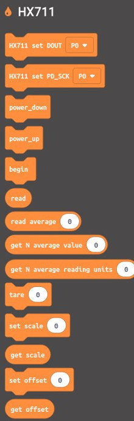
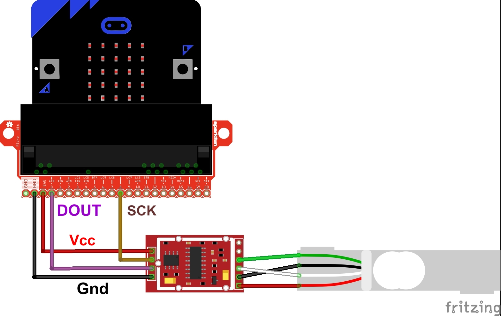
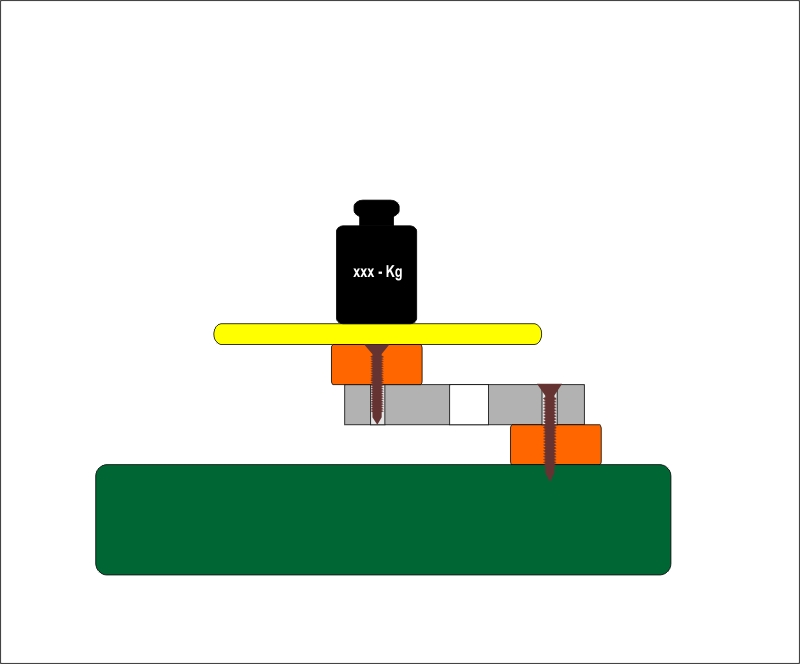

# BBC micro:bit MakeCode editor extension for HX711 connected to weight sensors

[HX711](https://www.mouser.com/datasheet/2/813/hx711_english-1022875.pdf) Based on Avia Semiconductor’s patented technology, HX711 is a precision 24-bit analog-to-digital converter (ADC) designed for weigh scales and industrial control applications to interface directly with a bridge sensor.

This extension allows you to use an HX711 module with the micro:bit as a weighing machine.

## Synopsis

The library myHX711 provides a set of functions to allow you to measure weight.

 


## HX711 set DataPin

||HX711 set DataPin||

This block function sets the pin where data comes in, i.e. Data Pin.

## HX711 set ClockPin

||HX711 set ClockPin||

This block function sets the clock pin for getting data from HX711 module, i.e. Clock Pin.

## begin

||begin||

This block function sets the module to begin readings. Required in the "on start" block.

## Power Up

||Power Up||

This block function awakens the HX711 module to be prepared for readings.

## Power Down

||Power Down||

This block function puts the HX711 module to sleep for lower power consumption.

## Read

||Read||

This block function reads an integer out without any taring or offset in the reading.

## read N averaged raw data

||read N averaged raw data||

This block function makes "N" number of integer readings without any taring or offset neither scaling in the readings and calculates an average.

## Get Offset

||Get Offset||

This block function gets the configured offset.

## Get Scale

||Get Scale||

This block function gets the configured scale. Scale is the maximum weight that can be measured, and depends on the cell used.

## Set Offset

||Set Offset||

This block function sets the configured offset to apply to the readings.

## Set Scale

||Set Scale||

This block function sets the configured scale. Scale is the maximum weight that can be measured, and depends on the cell used.

## Tare

||tare||

This block function tares to zero with "N" readings, applying an offset to set the zero. "tare(N)" has an input parameter that cannot be zero. It should at least should be 1 for one reading. We recomend a value of 10.

## get N averaged offsetted data

||get N averaged offsetted data||

This block function gets the final value of the weight applying the configured offset only but without scale. The N parameter must be higher than 1. The returned result will be N averaged.

## get N averaged final scaled value

||get N averaged final scaled value||

This block function gets the final value of the weight applying the configured scale and offset. N parameter must be higher than 1. The returned result will be N averaged.


### Blocking mode
The library is usually used in blocking mode, i.e. it will wait for the
hardware to become available before returning a reading.

```
// 1. HX711 circuit wiring
Select Data Pin;
Select Clock Pin;

// 2. Adjustment settings and Initialization of the library
begin();
setscale = 2000;
set_offset = 50682624;

// 3. Acquire reading
Serial print("Weight: ");
Serial print line(get N averaged final scaled value(10));

```

## Features
1. It provides a `tare(N)` function, which "resets" the scale to 0. Many other
   implementations calculate the tare weight when the ADC is initialized only.
   we should have a way to be able to set the tare weight at any time.

    **Use case**: Place an empty container on the scale, call `tare(N)` to reset
    the readings to 0, fill the container and get the weight of the content.
    N could be 10 for example, which will average the tare set.

2. It provides a `power_down()` function, to put the ADC into a low power mode.
   According to the datasheet,
   > When PD_SCK pin changes from low to high and stays at high
   > for longer than 60μs, HX711 enters power down mode.

   **Use case**: Battery-powered scales. Accordingly, there is a `power_up()`
   function to get the chip out of the low power mode.

3. The initializer method `begin()` has a a built-in `set_gain(byte gain)` function that allows you to set the gain factor
   and select the channel. According to the datasheet,
   > Channel A can be programmed with a gain of 128 or 64, corresponding to
   a full-scale differential input voltage of ±20mV or ±40mV respectively, when
   a 5V supply is connected to AVDD analog power supply pin. Channel B has
   a fixed gain of 32.

   The same function is used to select the channel A or channel B, by passing
   128 or 64 for channel A, or 32 for channel B as the parameter. The default
   value is 128, which means "channel A with a gain factor of 128", so one can
   simply call `set_gain()`. Don't worry too much about this comment, because the `begin()` method does the work for you.
   And only uses Channel A for gauge measuring.

4. The `read N averaged raw data`, `get N averaged offsetted data()` and `get N averaged final scaled value(10)` functions must receive an extra parameter "times",
   and they will return the N times average of multiple readings instead of a single reading.


## How to calibrate your load cell
1. Call `set_scale(Cell Full Scale)`, for example, for a 2kg cell, start with 2000.
2. Call `tare(10)` to tare it with 10 readings.
3. Place a known weight on the scale and call `get_N_average_reading_units(10)`.
4. Divide the result in step 3 to your known weight. You should
   get about the parameter you need to pass to `set_scale(XX)`.
5. Adjust the parameter in step 4 until you get an accurate reading.


For example, if you put a weight of 100g and you get a reading of 104g, you should do 104/100 and multiply the result by scale to set again the scale as commented above.

## Credits
Thanks to Weihong Guan who started the first version of this library in 2012
already (see [[arduino|module]Hx711 electronic scale kit](http://aguegu.net/?p=1327),
[sources](https://github.com/aguegu/ardulibs/tree/master/hx711)), Bogdan Necula
who took over in 2014 and last but not least all others who contributed to this
library over the course of the last years.

#### See also
My codes are based on [Arduino sources - 2018 Bogdan Necula](https://github.com/bogde/HX711) Which I've translated from Arduino C to Microbit Makecode (Typescript).


## Blocks

The extension can be used for HX711 modules.

FULL EXAMPLE: (almost all commands)


```blocks
let valor_string = ""
let ceros = ""
let valor: number = 0
HX711.SetPIN_DOUT(DigitalPin.P0)
HX711.SetPIN_SCK(DigitalPin.P8)
HX711.begin()
serial.redirect(
SerialPin.USB_TX,
SerialPin.USB_RX,
BaudRate.BaudRate9600
)
serial.writeLine("HX711 Initializing Scale: ")
serial.writeLine("Before Setting Up the Scale: ")
serial.writeString("Read: ")
serial.writeLine("" + HX711.read())
serial.writeString("Read Average: ")
serial.writeLine("" + HX711.read_average(20))
serial.writeString("Get Value: ")
serial.writeLine("" + HX711.get_value(5))
serial.writeString("Get Units: ")
serial.writeLine("" + HX711.get_units(5))
HX711.set_scale(2280)
HX711.tare(1)
basic.pause(1000)
serial.writeString("Read:")
serial.writeLine("" + HX711.read())
serial.writeString("Read Average:")
serial.writeLine("" + HX711.read_average(20))
serial.writeString("Get Value:")
serial.writeLine("" + HX711.get_value(5))
serial.writeString("Get Units")
serial.writeLine("" + HX711.get_units(5))
serial.writeLine("")
serial.writeLine("")
serial.writeLine("")
serial.writeLine("")
serial.writeLine("Readings: ")
basic.pause(1000)
basic.forever(function () {
    serial.writeString("One Reading: ")
    valor = HX711.get_units(1)
    ceros = ""
    if (Math.abs(Math.round((valor - Math.trunc(valor)) * 100)).toString().length == 0) {
        ceros = "00"
    } else if (Math.abs(Math.round((valor - Math.trunc(valor)) * 100)).toString().length == 1) {
        ceros = "0"
    }
    valor_string = "" + Math.trunc(valor) + "." + ceros + Math.abs(Math.round((valor - Math.trunc(valor)) * 100))
    serial.writeLine(valor_string)
    serial.writeString("Average: ")
    valor = HX711.get_units(20)
    ceros = ""
    if (Math.abs(Math.round((valor - Math.trunc(valor)) * 100)).toString().length == 0) {
        ceros = "00"
    } else if (Math.abs(Math.round((valor - Math.trunc(valor)) * 100)).toString().length == 1) {
        ceros = "0"
    }
    valor_string = "" + Math.trunc(valor) + "." + ceros + Math.abs(Math.round((valor - Math.trunc(valor)) * 100))
    serial.writeLine(valor_string)
    HX711.power_down()
    basic.pause(4000)
    HX711.power_up()
    basic.pause(100)
})


```


## Sensor wiring

The Load Cell Amplifier is a small breakout board for the HX711 IC that allows you to easily read load cells to measure weight. By connecting the amplifier to your microcontroller you will be able to read the changes in the resistance of the load cell and with some calibration you’ll be able to get very accurate weight measurements. This can be handy for creating your own industrial scale, process control, or simple presence detection of an object.

The HX711 uses a two wire interface (Clock and Data) for communication. Any microcontroller’s GPIO pins should work and numerous libraries have been written making it easy to read data from the HX711.

Load cells use a four wire wheatstone bridge to connect to the HX711. These are commonly colored RED, BLK, WHT, GRN. Each color corresponds to the conventional color coding of load cells:

- Red (Excitation+)
- Black (Excitation-)
- White (Amplifier-)
- Green (Amplifier+)

If you invert White & Green wires you'll get reading with negative sign.



## HOW TO MOUNT - EXAMPLE

You can follow this example to make an implementation of a weighing machine.


## License

MIT

## Supported targets

* for PXT/microbit
(The metadata above is needed for package search.)

