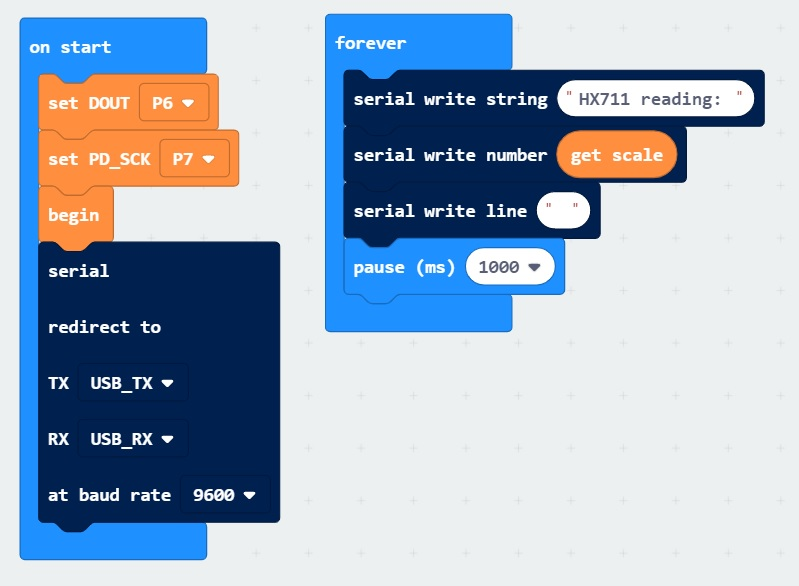
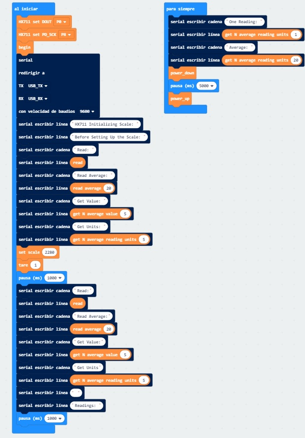

# BBC micro:bit MakeCode editor extension for HX711 connected to weight sensors

[HX711](https://www.mouser.com/datasheet/2/813/hx711_english-1022875.pdf) Based on Avia Semiconductor’s patented technology, HX711 is a precision 24-bit analog-to-digital converter (ADC) designed for weigh scales and industrial control applications to interface directly with a bridge sensor. 

My codes are based on [Arduino sources - 2018 Bogdan Necula](https://github.com/bogde/HX711) Which I've translated from Arduino C to Microbit Makecode.

To import this extension, go to Advanced -> +Extension and enter "myHX711" in the search box, or copy/paste [https://github.com/daferdur/pxt-myHX711](https://github.com/daferdur/pxt-myHX711) into the search box. Press enter and click the extension.


## Synopsis

### Blocking mode
The library is usually used in blocking mode, i.e. it will wait for the
hardware becoming available before returning a reading.

// 1. HX711 circuit wiring
Select DOUT_PIN;
Select SCK_PIN;

// 2. Adjustment settings and Initialization of the library
begin;
setscale = 5895655;
set_offset = 50682624;

// 3. Acquire reading
Serial print("Weight: ");
Serial print line(get_units(10));

### Non-blocking mode
It is also possible to define a maximum timeout to wait for the hardware
to be initialized. This won't send the program into a spinlock when the
scale is disconnected and will probably also account for hardware failures.
```
// 3. Acquire reading without blocking
if (wait_ready_timeout(1000)) {
    Serial print("Weight: ");
    Serial print line(get_units(10));
} else {
    Serial printline("HX711 not found.");
}
```

## Features
1. It provides a `tare()` function, which "resets" the scale to 0. Many other
   implementations calculate the tare weight when the ADC is initialized only.
   I needed a way to be able to set the tare weight at any time.
   **Use case**: Place an empty container on the scale, call `tare()` to reset
   the readings to 0, fill the container and get the weight of the content.

2. It provides a `power_down()` function, to put the ADC into a low power mode.
   According to the datasheet,
   > When PD_SCK pin changes from low to high and stays at high
   > for longer than 60μs, HX711 enters power down mode.

   **Use case**: Battery-powered scales. Accordingly, there is a `power_up()`
   function to get the chip out of the low power mode.

3. It has a `set_gain(byte gain)` function that allows you to set the gain factor
   and select the channel. According to the datasheet,
   > Channel A can be programmed with a gain of 128 or 64, corresponding to
   a full-scale differential input voltage of ±20mV or ±40mV respectively, when
   a 5V supply is connected to AVDD analog power supply pin. Channel B has
   a fixed gain of 32.

   The same function is used to select the channel A or channel B, by passing
   128 or 64 for channel A, or 32 for channel B as the parameter. The default
   value is 128, which means "channel A with a gain factor of 128", so one can
   simply call `set_gain()`.

   This function is also called from the initializer method `begin()`.

4. The `get_value()` and `get_units()` functions can receive an extra parameter "times",
   and they will return the average of multiple readings instead of a single reading.


## How to calibrate your load cell
1. Call `set_scale()` with no parameter.
2. Call `tare()` with no parameter.
3. Place a known weight on the scale and call `get_units(10)`.
4. Divide the result in step 3 to your known weight. You should
   get about the parameter you need to pass to `set_scale()`.
5. Adjust the parameter in step 4 until you get an accurate reading.


## Credits
Thanks to Weihong Guan who started the first version of this library in 2012
already (see [[arduino|module]Hx711 electronic scale kit](http://aguegu.net/?p=1327),
[sources](https://github.com/aguegu/ardulibs/tree/master/hx711)), Bogdan Necula
who took over in 2014 and last but not least all others who contributed to this
library over the course of the last years, see also `CONTRIBUTORS.rst` in this
repository.

#### See also
- https://item.taobao.com/item.htm?id=18121631630
- https://item.taobao.com/item.htm?id=544769386300


## Blocks

The extension can be used for HX711 modules.

BASIC EXAMPLE (get reading):



```blocks
HX711.SetPIN_DOUT(PIN_DOUT.P6)
HX711.SetPIN_SCK(PIN_SCK.P7)
HX711.begin()
serial.redirect(
    SerialPin.USB_TX,
    SerialPin.USB_RX,
    BaudRate.BaudRate9600
)
basic.forever(function () {
    serial.writeString("HX711 reading: ")
    serial.writeNumber(HX711.get_scale())
    serial.writeLine("")
    basic.pause(1000)
})

```
FULL EXAMPLE:



```blocks
HX711.SetPIN_DOUT(PIN_DOUT.P6)
HX711.SetPIN_SCK(PIN_SCK.P7)
HX711.begin()
serial.redirect(
    SerialPin.USB_TX,
    SerialPin.USB_RX,
    BaudRate.BaudRate9600
)
basic.forever(function () {
    serial.writeString("HX711 reading: ")
    serial.writeNumber(HX711.get_scale())
    serial.writeLine("")
    basic.pause(1000)
})

```


## Sensor wiring

The SparkFun Load Cell Amplifier is a small breakout board for the HX711 IC that allows you to easily read load cells to measure weight. By connecting the amplifier to your microcontroller you will be able to read the changes in the resistance of the load cell and with some calibration you’ll be able to get very accurate weight measurements. This can be handy for creating your own industrial scale, process control, or simple presence detection of an object.

The HX711 uses a two wire interface (Clock and Data) for communication. Any microcontroller’s GPIO pins should work and numerous libraries have been written making it easy to read data from the HX711.

Load cells use a four wire wheatstone bridge to connect to the HX711. These are commonly colored RED, BLK, WHT, GRN, and YLW. Each color corresponds to the conventional color coding of load cells:

- Red (Excitation+ or VCC)
- Black (Excitation- or GND)
- White (Amplifier+, Signal+, or Output+)
- Green (A-, S-, or O-)
- Yellow (Shield)

The YLW pin acts as an optional input that is not hooked up to the strain gauge but is utilized to ground and shield against outside EMI (electromagnetic interference). Please keep in mind that some load cells might have slight variations in color coding.

## License

MIT

## Supported targets

* for PXT/microbit
(The metadata above is needed for package search.)

## TO DO

* It hasn't been tested yet.
Any errors, please report. Thanks.

